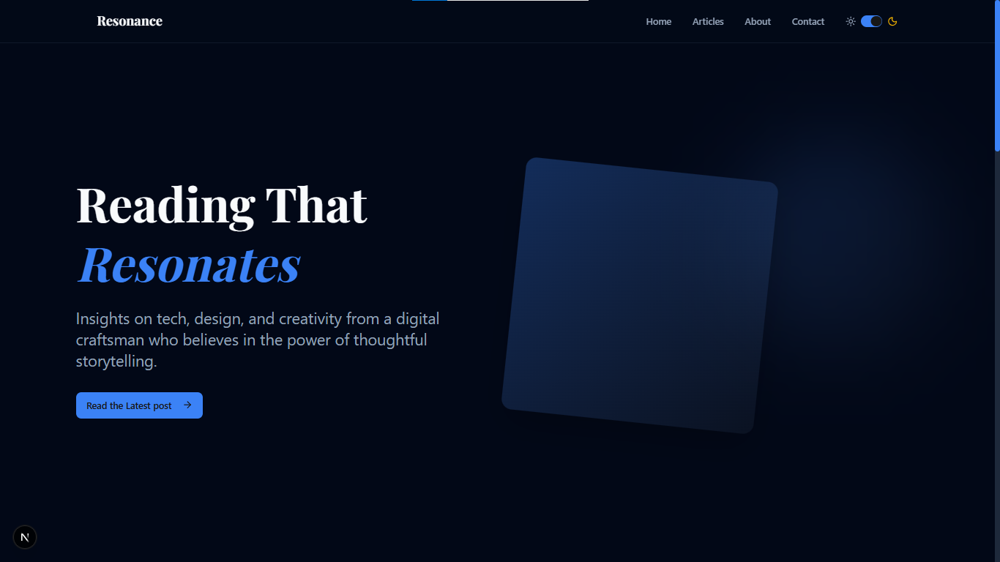

# 🌐 Blog Homepage – Built with Next.js 15 & Shadcn UI

A sleek and modern blog homepage created using the latest **Next.js 15 App Router**, **Tailwind CSS v4**, **Shadcn UI components**, and **motion.dev** for smooth animations.

This project is fully responsive, performance-optimized, and built to provide a clean, readable, and engaging user experience for tech and design enthusiasts.

---

## 🖼️ Preview



---

## 🚀 Features

- ✅ **Next.js 15** App Router
- 🎨 Fully styled with **Tailwind CSS v4**
- 🧩 Beautiful UI built with **Shadcn UI components**
- 🌙 Light & Dark mode toggle with **next-themes**
- 🌀 Smooth scroll and animations via **motion.dev**
- 📱 100% **Responsive Design** on all screen sizes
- 📚 Structured for a real blog:
  - Hero Section
  - Featured Posts (Cards)
  - Animated Categories
  - Quote Section (random on reload)
  - Navigation + Mobile Menu (Shadcn Sheet)
  - Footer with subscription input

---


---

## 🛠️ Getting Started

To run this project locally:

```bash
# Clone the repo
git clone https://github.com/LamaAli4/Blog-Project.git
cd blog-homepage

# Install dependencies
npm install
# or
yarn install

# Run the development server
npm run dev
# or
yarn dev

🧪 Built With
Next.js 15

Tailwind CSS v4

Shadcn UI

Motion.dev

Lucide Icons

TypeScript


